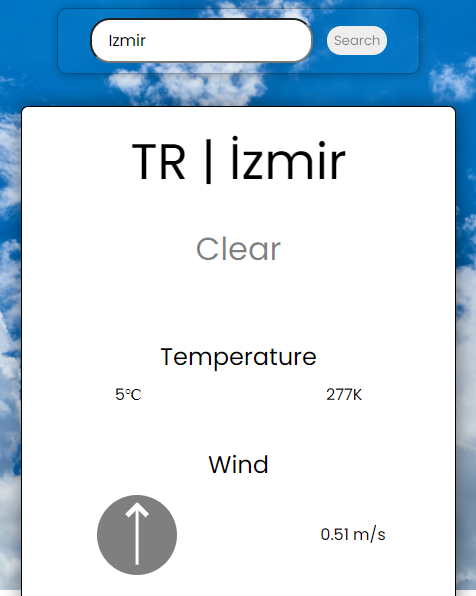

# Weather App
This project aims to learn
* how to generate an API key,
* how to implement .env file,
* how to use API endpoints, 
* how to handle the data which comes from API
## This is how the app looks:

## Usage
### Clone the project
### Install packages
Execute the command `npm install` in your terminal.
### Create .env file
Create `.env` file in your project's root folder. Then define the `REACT_APP_API_KEY` with the key which you got from [OpenWeatherMap](https://openweathermap.org/api).
### Run!
Execute the command `npm start` in your terminal.
